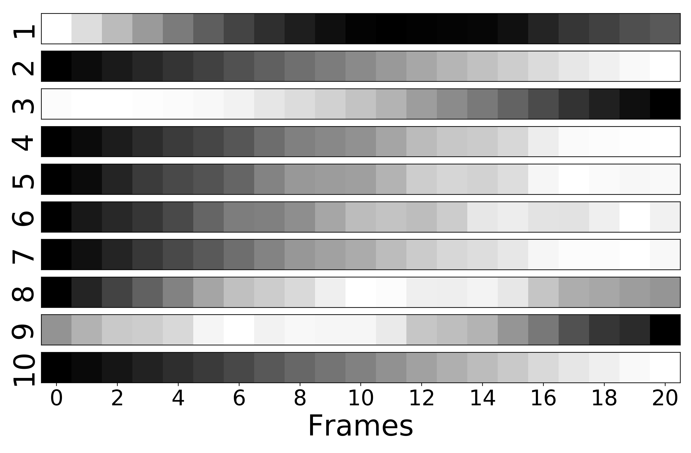
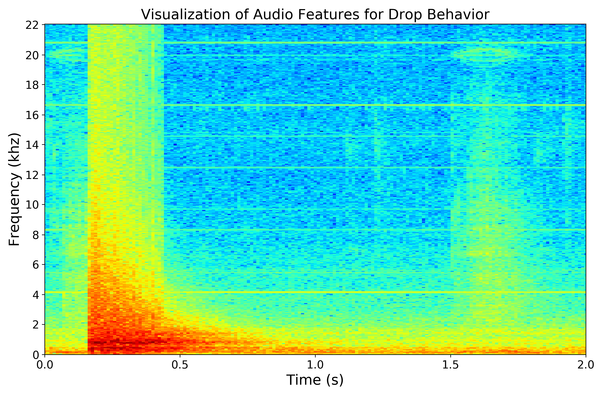
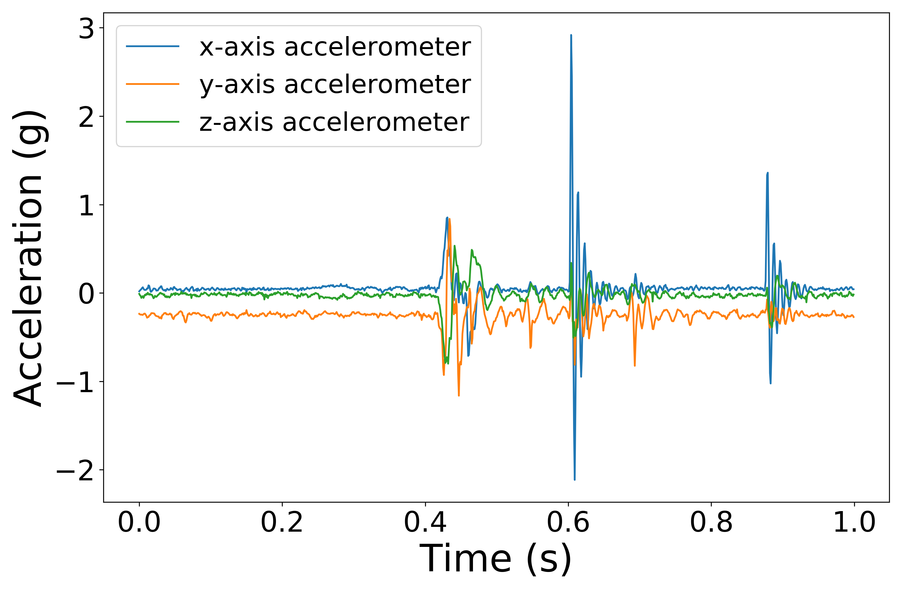

# Visual Next-Frame Prediction using Multisensory Perception for Embodied Agents

**Abstract:**

> Predicting future visual frames plays a pivotal role in learning agents such as robots, drones, and autonomous vehicles. In this study, we couple multiple sensory modalities with exploratory actions and propose a novel predictive neural network architecture to address this issue. Most existing approaches rely on large, manually annotated datasets, which is extremely expensive, or they only use visual data as a single input modality to predict future visual frames. However, the unsupervised method presented here uses multi-modal perception for learning using raw visual frames. As a result, the proposed model is more comprehensive and can better capture the spatio-temporal dynamics of the environment, leading to a more accurate visual frame prediction. The other novelty of the proposed network architecture is 3 sub-networks dedicated to anticipating future haptic, audio, and tactile signals. From literature searches, it appears to be the only framework in this context which forecasts future frames for modalities other than vision. The framework was tested and validated with a dataset containing 4 sensory modalities (vision, haptic, audio, and tactile) on a humanoid robot performing 9 behaviors multiple times. While the visual information is the dominant modality, utilizing the network with more modalities, is shown to improve the accuracy of predictions. Experiments were conducted to compare and contrast the network to the state-of-the-art vision only method to demonstrate the improvements.

## Development Environment

## Dependencies

## Dataset
We used the publicly available dataset collected by Sinapov et al. [see reference 7 in the paper] to evaluate and compare our proposed network with the single-modal network. For collecting this dataset, an uppertorso humanoid robot with a 7-DOF arm manipulates 100 objects by executing 9 different exploratory behaviors (*push, poke, press, shake, lift, drop, grasp, tap* and *hold*) multiple times. The robot records visual, haptic, auditory and vibrotactile data using 4 sensors. The dataset can be found [here](https://tufts.box.com/s/lk4tcyf8jnmpnlhpfofw4lg1khcn2ia1).
## How to run the code?

## Experiment Pipeline 

## Results

### Dataset Visualization

  

