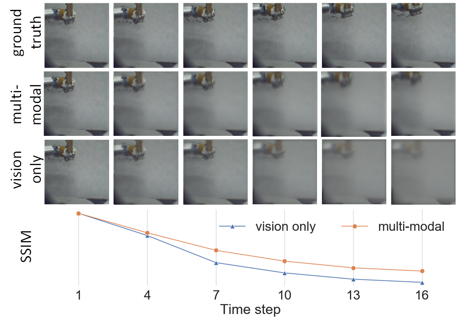
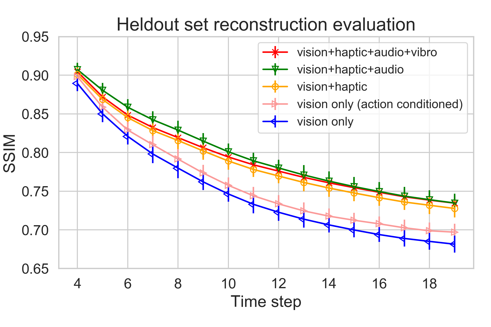

# Visual Next-Frame Prediction using Multisensory Perception for Embodied Agents

**Abstract**
><div style="text-align: justify">Predicting future visual frames plays a pivotal role in learning agents such as robots, drones, and autonomous vehicles. In this study, we couple multiple sensory modalities with exploratory actions and propose a novel predictive neural network architecture to address this issue. Most existing approaches rely on large, manually annotated datasets, which is extremely expensive, or they only use visual data as a single input modality to predict future visual frames. However, the unsupervised method presented here uses multi-modal perception for learning using raw visual frames. As a result, the proposed model is more comprehensive and can better capture the spatio-temporal dynamics of the environment, leading to a more accurate visual frame prediction. The other novelty of the proposed network architecture is 3 sub-networks dedicated to anticipating future haptic, audio, and tactile signals. From literature searches, it appears to be the only framework in this context which forecasts future frames for modalities other than vision. The framework was tested and validated with a dataset containing 4 sensory modalities (vision, haptic, audio, and tactile) on a humanoid robot performing 9 behaviors multiple times. While the visual information is the dominant modality, utilizing the network with more modalities, is shown to improve the accuracy of predictions. Experiments were conducted to compare and contrast the network to the state-of-the-art vision only method to demonstrate the improvements.</div>

<!-- 
**Authors:** Xiaohui Chen\*, Ramtin Hosseini\*, Karen Panetta and Jivko Sinapov -->
<!-- 
\* These authors contributed equally to this work. -->

## Environment Setup
pip install -r requirements.txt

## Dataset Preparation
Description: https://www.eecs.tufts.edu/~ramtin/pages/2014/CY101Dataset.html

Download: https://tufts.app.box.com/v/DeepMultiSensoryDataset

Preparation:
```bash
$ python ./data/make_data.py \
        --data_dir path-to-downloaded-data-directory \ 
        --out_dir path-to-output-data-directory \
```


## Usage
```bash
$ python ./main.py  \
        --data_dir path-to-data\ # directory containing data
        --channels 3 \ # channels of input
        --height 64 \ # height of image
        --width 64 \ # width of image
        --output_dir path-to-checkpoint-dir \ # directory for model weight
        --pretrained_model path-to-checkpoint \ # filepath of a pretrained model to initialize from
        --sequence_length 10 \ # sequence length + context frames
        --context_frames 4 \ # the number of ground truth frames to pass in at start
        --model CDNA \ # model architecture to use - CDNA | DNA | STP
        --num_masks 10 \ # number of masks, usually 1 for DNA, 10 for CDNA, STP
        --device cuda  \ # device cuda | cpu
        --dna_kern_size 5 \ # CDNA_KERN_SIZE
        --haptic_layer 16 \ # HAPTIC_LAYER
        --use_haptic \ # Whether or not to give the haptic to the model
        --behavior_layer 9 \ # number of chosen behaviors
        --use_behavior \ # Whether or not to give the behavior to the model
        --audio_layer 16 \ # AUDIO_LAYER
        --use_audio \ # Whether or not to give the audio to the model
        --vibro_layer 16 \ # VIBRO_LAYER
        --use_vibro \ # Whether or not to give the vibro to the model
        --aux \ # Whether or not to employ auxiliary tasks during training 
        --print_interval 100 \ # iterations to output loss
        --schedsamp_k  400 \ # The k hyperparameter for scheduled sampling, -1 for no scheduled sampling
        --batch_size 32 \ # batch size for training
        --learning_rate 0.001, \ # the base learning rate
        --epochs 30 \ # total training epochs
```
## Architecture
 
<p>The architecture of the proposed model, which consists of 4 feature encoders (left) and prediction heads (right) for 4 modalities, and 1 fusion module (middle) for merging representations of different modalities.</p>

  
<p>Pipeline of The Visual Prediction Module: the architecture of visual feature extractor (left), the architecture of visual prediction network (right).</p>

## Results

### Dataset Visualization

  
<p>Visualization of haptic (left), audio (middle) and vibrotactile (right) modalities when the robot drops a bottle</p>

### Training the Network with All Behaviors

#### Illustrative Example

 
<p>Sharpness of predicted images, when the robot arm perform lift (left) and push (right) behaviors. For each behavior, top row is ground truth, middle row is multi-modal and bottom row is the vision only approach</p>

#### Quantitative Reconstruction Performance

 
<p>PSNR (left) and SSIM (right), when all behaviors are used in conducting experiments</p>


<p>PSNR (left) and SSIM (right), investigating the effect of adding behavior as an input feature</p>


#### Training the Network with Individual Behavior


<p>Investigating the performance of different combinations of modalities per individual behavior</p>

#### Predicting Future Frames of Auxiliary Modalities


